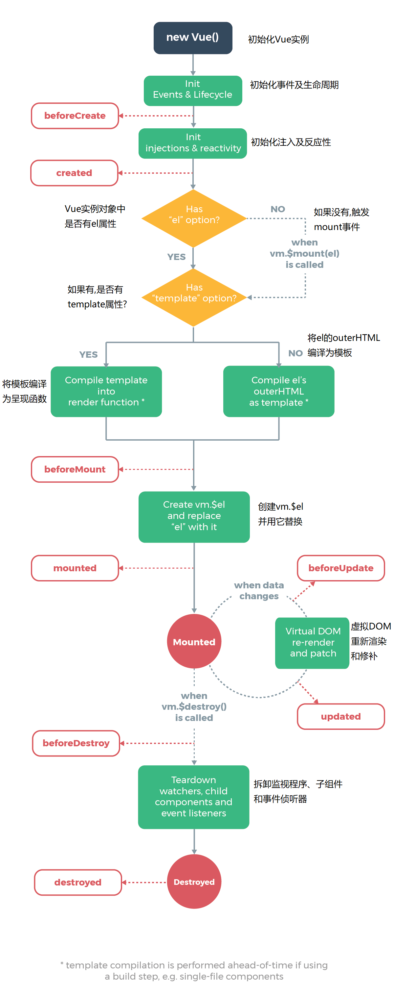

### 一些琐碎知识点

- Vue没有完全遵循MVVM模型.

-  当一个 Vue 实例被创建时，它将 `data` 对象中的所有的 property 加入到 Vue 的**响应式系统**中。（会将data中的数据挂载到vue实例上）当这些 property 的值发生改变时，视图将会产生“响应”，即匹配更新为新的值。 
  
  - 但如果这个值一开始没有声明或使用`Object.freeze()`，阻止修改现有的 property ,则不会监听
  
-  除了数据 property，Vue 实例还暴露了一些有用的实例 property 与方法。它们都有前缀 `$`，以便与用户定义的 property 区分开来。例如： vm.$watch('a',function(){})
  
  - 在选项property或回调函数中,可以但最好不要使用箭头函数.因为this指向的原因,很容易导致各类bug
  
- 初始化一个vue实例
  
  -   
  
- vue指令
  - v-once.进行一次性地插值,当数据再改变时,插值处的内容不会更新.但请留意该节点上其他的数据绑定.包括其子元素.
    - 会触发beforeUpdate
  - v-html. 动态渲染的任意 HTML 可能会非常危险，因为它很容易导致 [XSS 攻击](https://en.wikipedia.org/wiki/Cross-site_scripting)。请只对可信内容使用 HTML 插值，**绝不要**对用户提供的内容使用插值。 
  - v-bind. 如果v-bind绑定的是null、undefined 或 false，则绑定属性甚至不会被包含在渲染出来的元素中。 
  -  每个绑定都只能包含**单个表达式**，所以语句和多行表达式是无法执行的
  -  模板表达式都被放在沙盒中，只能访问[全局变量的一个白名单](https://github.com/vuejs/vue/blob/v2.6.10/src/core/instance/proxy.js#L9)，如 `Math` 和 `Date` 。你不应该在模板表达式中试图访问用户定义的全局变量。 
  
- 动态参数

  - 可以使用:[attr()]=的写法动态绑定属性.但请注意,只有在vue2.6.0以后才会生效
  - 动态参数预期会求出一个字符串，异常情况下值为 `null`。这个特殊的 `null` 值可以被显性地用于移除绑定。任何其它非字符串类型的值都将会触发一个警告。

- 修饰符

  - ```
    <form v-on:submit.prevent="onSubmit">
    	...
    </form> 
    ```

- 计算属性

  - 模板内的表达式非常便利，但是设计它们的初衷是用于简单运算的。在模板中放入太多的逻辑会让模板过重且难以维护。 因此,**对于复杂逻辑,应当使用计算属性**
  -  **计算属性是基于它们的响应式依赖进行缓存的**。只在相关响应式依赖发生改变时它们才会重新求值 
    - 因此,Date.now()不会更新,因为其不是响应式依赖
    - 如果不想使用缓存,则应用方法来代替
  -  计算属性默认只有 getter，不过在需要时你也可以提供一个 setter

- 侦听器

  - 虽然计算属性在大多数情况下更合适，但有时也需要一个自定义的侦听器。这就是为什么 Vue 通过 `watch` 选项提供了一个更通用的方法，来响应数据的变化。当需要在数据变化时执行异步或开销较大的操作时，这个方式是最有用的。 

- :class

  - 可以传给class一个对象,动态地渲染,且:class和class可以同时被渲染,不会冲突.可以用计算属性来动态确定类名的显隐
  - 多种不同的写法
    -  :class="[activeClass, errorClass]" 
    -  :class="{ active: isActive, 'text-danger': hasError }" 

-  :style 

  -  :style 的对象语法十分直观——看着非常像 CSS，但其实是一个 JavaScript 对象。CSS property 名可以用驼峰式 (camelCase) 或短横线分隔 (kebab-case，记得用引号括起来) 来命名
  - 写法,基本同上.
  -  当v-bind:style使用需要添加[浏览器引擎前缀](https://developer.mozilla.org/zh-CN/docs/Glossary/Vendor_Prefix)的 CSS property 时，如 `transform`，Vue.js 会自动侦测并添加相应的前缀。 
  -  从 2.3.0 起你可以为 `style` 绑定中的 property 提供一个包含多个值的数组，常用于提供多个带前缀的值 
    -  :style="{ display: ['-webkit-box', '-ms-flexbox', 'flex'] }" 
    - 个人想法,这个地方与自动添加前缀有些冲突.但是可以针对浏览器的不同版本做适配.
      - 经大佬指点,这个自动添加前缀的效果,可能会有盲区照顾不到.为了防止这种情况.可以使用这种写法.

- :key

  -  Vue 会尽可能高效地渲染元素，通常会复用已有元素而不是从头开始渲染。这么做除了使 Vue 变得非常快之外，还有其它一些好处.
  - 但这样也不总是符合实际需求，所以 Vue 为你提供了一种方式来表达“这两个元素是完全独立的，不要复用它们”。只需添加一个具有唯一值的 key attribute
  - 就拿路由刷新举例,如果希望某个组件完整地走一遍创建到销毁的流程.就需要给他们加key

- 为什么v-for要绑定key

  - 当 Vue 正在更新使用 `v-for` 渲染的元素列表时，它默认使用“就地更新”的策略。如果数据项的顺序被改变，Vue 将不会移动 DOM 元素来匹配数据项的顺序，而是就地更新每个元素，并且确保它们在每个索引位置正确渲染。这个类似 Vue 1.x 的 `track-by="$index"`。
  - 这个默认的模式是高效的，但是**只适用于不依赖子组件状态或临时 DOM 状态 (例如：表单输入值) 的列表渲染输出**。
  - 为了给 Vue 一个提示，以便它能跟踪每个节点的身份，从而重用和重新排序现有元素，你需要为每项提供一个唯一 `key` attribute
  -  2.2.0+ 的版本里，当在组件上使用 `v-for` 时，`key` 现在是必须的。 

- 数组更新监测

  - 由于 JavaScript 的限制，Vue **不能检测**数组和对象的变化。 
  -  Vue 将被侦听的数组的变更方法进行了包裹，所以它们也将会触发视图更新。这些被包裹过的方法包括 
    - `push()`
    - `pop()`
    - `shift()`
    - `unshift()`
    - `splice()`
    - `sort()`
    - `reverse()`
  - 变更方法，顾名思义，会变更调用了这些方法的原始数组。相比之下，也有非变更方法，例如 `filter()`、`concat()` 和 `slice()`。它们不会变更原始数组，而**总是返回一个新数组**。当使用非变更方法时，可以用新数组替换旧数组.

- v-for与v-if的优先级哪个更高?

  - v-for的更高,因此,if可以通过item.val的方式来进行动态渲染
  - 但注意,vue官方不推荐这样做.

- 事件修饰符

  - `.stop`
  - `.prevent`
  - `.capture`
  - `.self`
  - `.once`
    - 唯一可以被用到自定义组件事件上的时间修饰符
  - `.passive`
    -  滚动事件的默认行为 (即滚动行为) 将会立即触发.而不会等待 `onScroll` 完成.这其中包含`event.preventDefault()` 的情况
    -  尤其能够提升移动端的性能 
    - 会忽略.prevent
  -  使用修饰符时，顺序很重要；相应的代码会以同样的顺序产生。 
    -  因此，用 `v-on:click.prevent.self` 会阻止**所有的点击**，而 `v-on:click.self.prevent` 只会阻止对元素自身的点击。 

- 按键修饰符

  - 可以直接将 [`KeyboardEvent.key`](https://developer.mozilla.org/en-US/docs/Web/API/KeyboardEvent/key/Key_Values) 暴露的任意有效按键名转换为 kebab-case 来作为修饰符 

- 系统修饰键

  - `.ctrl`
  - `.alt`
  - `.shift`
  - `.meta`
    - 在各个系统上,meta键都不同,使用时需要注意
  -  .exact 
    - 控制由精确的系统修饰符组合触发的事件 
    - 拿click.ctrl举例,只有在同时按下click和ctrl时才会触发,同时按到其他键的时候不会触发

- 鼠标按钮修饰符

  - `.left`
  - `.right`
  - `.middle`

- `v-model` 

  - 会忽略所有表单元素的 `value`、`checked`、`selected` attribute 的初始值而总是将 Vue 实例的数据作为数据来源。 因此, 你应该通过 JavaScript 在组件的 `data` 选项中声明初始值。 
  - 在内部为不同的输入元素使用不同的 property 并抛出不同的事件 
    - text 和 textarea 元素使用 `value` property 和 `input` 事件；
    - checkbox 和 radio 使用 `checked` property 和 `change` 事件；
      -  单个复选框，绑定到布尔值 
      -  多个复选框，绑定到同一个数组 
    - select 字段将 `value` 作为 prop 并将 `change` 作为事件。
      -  如果 `v-model` 表达式的初始值未能匹配任何选项，`` 元素将被渲染为“未选中”状态。在 iOS 中，这会使用户无法选择第一个选项。因为这样的情况下，iOS 不会触发 change 事件。因此，更推荐像上面这样提供一个值为空的禁用选项。 
  - 对于需要使用[输入法](https://zh.wikipedia.org/wiki/输入法) (如中文、日文、韩文等) 的语言，你会发现 `v-model` 不会在输入法组合文字过程中得到更新。如果你也想处理这个过程，请使用 `input` 事件。 
  -  一个组件上的 `v-model` 默认会利用名为 `value` 的 prop 和名为 `input` 的事件，但是像单选框、复选框等类型的输入控件可能会将 `value` attribute 用于[不同的目的](https://developer.mozilla.org/en-US/docs/Web/HTML/Element/input/checkbox#Value)。`model` 选项可以用来避免这样的冲突： 

- v-model修饰符

  - .lazy
    - 在默认情况下，`v-model` 在每次 `input` 事件触发后将输入框的值与数据进行同步 (除了[上述](https://cn.vuejs.org/v2/guide/forms.html#vmodel-ime-tip)输入法组合文字时)。你可以添加 `lazy` 修饰符，从而转为在 `change` 事件_之后_进行同步 
  - .number
    - 如果想自动将用户的输入值转为数值类型，可以给 `v-model` 添加 `number` 修饰符
    - 这通常很有用，因为即使在 `type="number"` 时，HTML 输入元素的值也总会返回字符串。如果这个值无法被 `parseFloat()` 解析，则会返回原始的值。 
  - .trim
    - 自动过滤用户输入的首尾空白元素

- 为什么组件中声明的data必须是个函数?

  - 每个实例可以维护一份被返回对象的独立的拷贝.

- 在组件上使用v-model

  - 自定义事件也可以用于创建支持 `v-model` 的自定义输入组件。 
  - 方法,父组件绑定特定事件A.子组件emit触发父组件事件A.随后在父组件特定事件A被触发,将子组件传来的值赋值给v-model绑定值,则实现了双向绑定.(实际上是父传子子传父的结合)
  - v-model会触发v-bind,因此无需再单独绑定v-bind

- 解析DOM模板时的注意事项

  - 有些 HTML 元素，诸如ul,ol,table和select，对于哪些元素可以出现在其内部是有严格限制的。而有些元素，诸如li,tr,option，只能出现在其它某些特定的元素内部。 

  - 这会导致我们使用这些有约束条件的元素时遇到一些问题。 

    - eg:  

      ```
      <table>   
          <blog-post-row>
          </blog-post-row> 
      </table>  
      ```

      

  - 这个自定义组件会被作为无效的内容提升到外部，并导致最终渲染结果出错。 

  - 解决方案

    - <table>
          <tr is="blog-post-row"></tr> 
      </table>  

    - 字符串 (例如：`template: '...'`)

    - 单文件组件.vue

    - <script type="text/x-template">

- 组件

  - 命名
    - 短横线命名
      -  my-component-name 
    - 首字母大写命名
      -  MyComponentName 
      -  在引用组件的时候也可以使用短横线
  
-  父级模板里的所有内容都是在父级作用域中编译的；子模板里的所有内容都是在子作用域中编译的。 

### 之后可以尝试的写法

- 组件
  - 基础组件的循环全局注册
- prop
  - 传入一个对象的所有property
    - v-bind="options"
    - :a="option.a" :b="option.b"
  - 改变prop值的情况
    - **这个 prop 用来传递一个初始值；这个子组件接下来希望将其作为一个本地的 prop 数据来使用。**在这种情况下，最好定义一个本地的 data property 并将这个 prop 用作其初始值 
    - **这个 prop 以一种原始的值传入且需要进行转换。**在这种情况下，最好使用这个 prop 的值来定义一个计算属性 
    - 在 JavaScript 中对象和数组是通过引用传入的，所以对于一个数组或对象类型的 prop 来说，在子组件中改变变更这个对象或数组本身**将会**影响到父组件的状态。 
  - 类型检查
    - type
      - 可以是一个自定义的构造函数.因为会用 instanceof 来检测构造函数的 `prototype` 属性是否出现在某个实例对象的原型链上.所以在使用时必须使用import从同一文件引入.否则会报错
    - default
    - required
    - validator
  - 关于父子组件传属性值
    - 对于绝大多数 attribute 来说，从外部提供给组件的值会替换掉组件内部设置好的值。所以如果传入`type="text"` 就会替换掉 `type="date"` 并把它破坏！
    - 庆幸的是，`class` 和 `style` attribute 会稍微智能一些，即两边的值会被合并起来，从而得到最终的值：`form-control date-picker-theme-dark`。 
  - 禁用attribute继承
    - 如果你**不**希望组件的根元素继承 attribute，你可以在组件的选项中设置 `inheritAttrs: false`。
  -  inheritAttrs: false 
    - 设置了该属性之后,就不会让组件的根元素继承attribute
    -  `inheritAttrs: false` 选项**不会**影响 `style` 和 `class` 的绑定。 
    -  $attrs 会获得该组件,未被props接收的其他属性
- $emit
  - @Event.native
    - 监听原生事件
  - 如果组件最外层的元素并非需要监听的元素,则.native可能监听失败.
    - 这时就需要$listeners属性来配合了
- .sync
  - 父子组件双向绑定的简单写法
    - 
    - 
- 插槽
  - 组件标签中写模板，子组件中使用slot元素接收，如果没有slot元素可以接收，则模板内容将会被抛弃
  - 个人理解
    - 搭配组件使用，留出一定空间接受html代码，让组件更灵活
  - 后备内容
    - 有时为一个插槽设置具体的后备 (也就是默认的) 内容是很有用的，它只会在没有提供内容的时候被渲染。 
      - 类似placeHolder
  - 具名插槽
    - 
    - 
  - 解构插槽prop
    - 
  - 动态插槽名
    - 
  - 缩写
    - v-slot==#
      - 不同, 该缩写只在其有参数的时候才可用 
- keep-alive
  - 重新创建动态组件的行为通常是非常有用的，但是在这个案例中，我们更希望那些标签的组件实例能够被在它们第一次被创建的时候缓存下来。为了解决这个问题，我们可以用一个 `` 元素将其动态组件包裹起来。 
- 异步组件
  - 
  - 1

